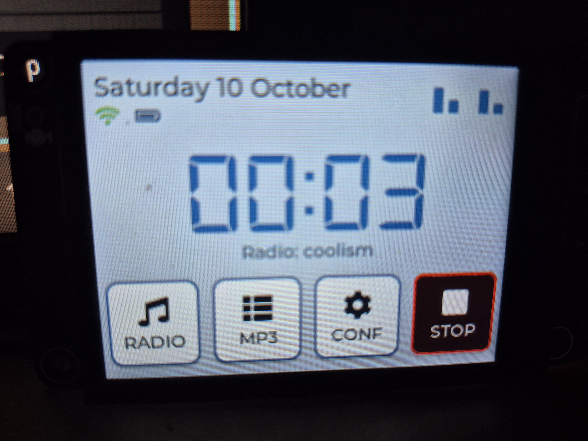

# netradio — Reveil-CYDGOLD port for ES3C28P

Internet Radio / MP3 Player / Alarm Clock บนบอร์ด **LCDWiki ES3C28P**
(ESP32-S3 N16R8, จอ ILI9341 240x320 + ทัช FT6336 + เสียง ES8311)



- ต้นฉบับ: https://github.com/cyrilrudler-create/Reveil-CYDGOLD (Arduino, LVGL 8)
- พินอ้างอิงฝั่ง xiaozhi: `../xiaozhi-esp32/main/boards/lcdwiki-es3c28p/config.h`
  พินจอ/ทัช/I2S/I2C ตรงกับ upstream CYD-GOLD ทั้งหมด จึงใช้ `src/config.h` เดิมได้

## โครงสร้าง

```
netradio/
  platformio.ini            env:es3c28p (arduino, flash 16MB, PSRAM OPI 8MB)
  partitions_16MB_cyd.csv   app0 7MB + littlefs ~9MB (เก็บ /config.bin)
  include/lv_conf.h         เปิดฟอนต์ Montserrat ที่ ui_* ใช้ (10–48)
  src/                      ซอร์สทั้งหมดจาก Reveil-CYDGOLD (+ main.cpp)
  src/config.h              พิน + ค่าปรับสำหรับ es3c28p (ดูด้านล่าง)
```

## ค่าที่ปรับจากต้นฉบับ (es3c28p)

| เรื่อง | ต้นฉบับ CYD-GOLD | netradio (es3c28p) |
|---|---|---|
| LED | แถบ WS2812 7 ดวง ขา 14 | LED ออนบอร์ด 1 ดวง ขา **42** (`WS_LED_PIN`/`NUM_LEDS`) |
| Sleep switch ขา 2 | เปิดเสมอ | **ปิด** (`ENABLE_SLEEP_SWITCH 0`) — บอร์ดเปล่าไม่มีสวิตช์ ขาลอย=HIGH จะหลับทันทีถ้าไม่ปิด |
| Timezone เริ่มต้น | ฝรั่งเศส | `ICT-7` (เอเชีย/กรุงเทพ) เปลี่ยนได้ใน Settings > Pays |
| TFT_eSPI | ไฟล์ User_Setup | defines ใน `platformio.ini` (`USER_SETUP_LOADED` + ขา 11/12/10/46/13/45) |
| LVGL | 8.3.11 (Arduino IDE) | 8.3.11 (PlatformIO) + `lv_conf.h` เปิดฟอนต์ |
| Partition | Arduino IDE 16M (3MB APP) | `partitions_16MB_cyd.csv`: app **7MB** (เฟิร์มแวร์ ~2.6MB) + littlefs ~9MB |

ไลบรารี (ตาม README ต้นฉบับ): `TFT_eSPI 2.5.43`, `lvgl 8.3.11`,
`ESP32-audioI2S 3.4.6`, `FastLED 3.10.3`, `RTClib 2.1.4`, `ArduinoJson 7.4.3`

## ประกอบกลับเป็น CYD-GOLD (ตู้ + อุปกรณ์ครบ)

แก้ `src/config.h`: `WS_LED_PIN 14`, `NUM_LEDS 7`, `ENABLE_SLEEP_SWITCH 1`

## Build / Flash

```bash
cd /home/pi/Documents/ESP/es3c28p/netradio
export PATH="$HOME/.platformio/penv/bin:$PATH"
pio run                    # build (ผ่านแล้ว: Flash ~2.6MB / 7MB)
pio run -t upload          # แฟลชผ่าน /dev/ttyACM0
pio device monitor          # ดู log 115200
```

ครั้งแรกตั้ง `Erase All Flash` ก็ได้ แล้วปิด (เหมือนต้นฉบับ)

## ใช้งานครั้งแรก

1. บูต: ฟอร์แมต LittleFS, สร้าง `/config.bin`, สร้างโฟลเดอร์ SD `/mp3` `/logos`,
   คืน `buzzer.mp3` + `logos/def.bin` จาก PROGMEM, สร้าง `/radios.json` (FIP)
2. ต่อ WiFi บนหน้าจอ (สแกน > คีย์บอร์ด > บันทึกได้หลายเครือข่าย)
3. Web manager: `http://<ip>/` user `admin` / `cydgold`
   **เปลี่ยนรหัสก่อนใช้จริง** (`WEB_USER`/`WEB_PASSWORD` ใน `src/web_server.cpp`)
4. เพิ่มสถานี/อัปโหลด MP3 + โลโก้ (PNG 100x100 → LVGL image converter v8,
   `CF_RGB565A8` binary) ผ่านหน้าเว็บ

## ข้อควรรู้

- **SD**: ต้นฉบับใช้ **SDMMC 4-bit** (38/40/39/41/48/47) ส่วน slot บน ES3C28P
  บางล็อตเดินสายแบบ **SPI** (38/39/40/CS 47 แบบใน `../ehradio`) ถ้า log ขึ้น
  `[SD] Card not found` วิทยุยังเล่นได้ (fallback FIP) แต่ MP3/โลโก้/SD ใช้ไม่ได้
  ต้องแก้ `display_gui.h` เป็น SPI หรือเช็คสายก่อน
- **RTC DS3231** เป็นโมดูลภายนอก ไม่มีก็ได้ — โค้ดข้ามนาฬิกา (`rtc_ok=false`) รอ NTP
- **Codec I2C** ใช้ ESP-IDF bus `I2C_NUM_1` ขาเดียวกับ Wire (16/15) ตามต้นฉบับ
  ถ้าทัช/เสียงชนกัน ให้ย้ายไป bus เดียวกันแบบ xiaozhi
- ปุ่ม BOOT (GPIO0) ใช้ได้, แบต ADC ขา 9, แอมป์ `AMP_EN` ขา 1 (LOW=เปิด)
